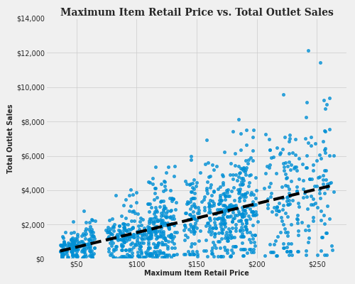
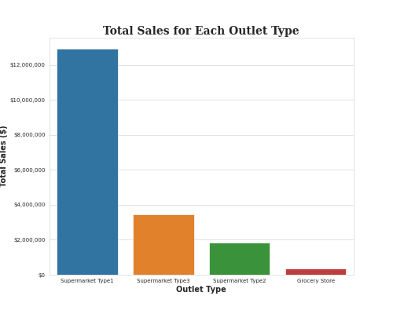

# Food Sale Predictions
## Modeling outlet sales to predict future sales based on outlet and product attributes
**Author:** Joshua Lensing
### Business Problem:
Outlet stores of various types are trying to gain an understanding of what contributes best to their sales numbers. By using attributes of the outlets and the products that they sell, they want to understand how that affects current sales and how it will be able to predict future sales. If various aspects can be improved, maybe sales can be increased as well.

The source of this dataset can be found [here](https://datahack.analyticsvidhya.com/contest/practice-problem-big-mart-sales-iii/).

Here is the data dictionary for this dataset:

| Variable Name |	Description |
|---------------|-------------|
Item_Identifier	| Unique product ID
Item_Weight |	Weight of product
Item_Fat_Content | Whether the product is low fat or regular
Item_Visibility |	The percentage of total display area of all products in a store allocated to the particular product
Item_Type |	The category to which the product belongs
Item_MRP |	Maximum Retail Price (list price) of the product
Outlet_Identifier |	Unique store ID
Outlet_Establishment_Year |	The year in which store was established
Outlet_Size |	The size of the store in terms of ground area covered
Outlet_Location_Type |The type of area in which the store is located
Outlet_Type |	Whether the outlet is a grocery store or some sort of supermarket
Item_Outlet_Sales |	Sales of the product in the particular store. This is the target variable to be predicted.

## Methods
- There were 2 columns that contained missing values: Item_Weight and Outlet_Size. For Item_Weight, I chose to fill in the missing values with the mean as the column contained floats, and the mean would not skew the overall average of the column. I chose to use mode for the Outlet_Size, as choosing the most common value in the column seemed to have the best chance at reducing error. The column contained only 3 different catergorical values, so imputing the mode was the logical choice since there were so few unique values.
- I deleted the 'Item_Identifier', 'Item_Visibility', 'Outlet_Identifier', 'Outlet_Location_Type' columns. Item_Identifier contained unique values to each row, so they were deleted. I also deleted Outlet_Identifier for the same reason, and although it was present in more than one row, it was not prevalent enough to keep it. Outlet_Location_Type did not seem necessary as we already have information on the types of outlets.
- The 'Item_Fat_Content had inconsistent values, so they were changed appropriately.

## Results
#### **Max Retail Price Vs. Outlet Sales**

> As the maximum retail price rises for a product, so do the outlet sales.

#### **Total Sales for Each Outlet Type**

> Supermarket Type 1 had the largest total outlet sales, more than the other 3 combined.

## Model
The Random Forest model had the best performance of the 3 models that were tested (Linear Regression, Decision Tree Model, and Random Forest Model). It was able to find the largest test R^2 test score of the models run and also had small variance, although that is insignificant when trying to maximize the test set score. Parameters for the number of leaf nodes and and the maximum depth were tuned as well and found that 11 leaf nodes at a depth of 5 produced the optimal test score. The RMSE and R^2 were vital in the performance of the model. MAE and MSE were not regression metrics tested.

## Recommendations:
Based on the better RMSE score compared to the Linear Regression model, and the better R^2 score on the testing data, I would most recommend using the the Random Forest model with the optimized parameters for this data set to predict the target values of outlet sales. The model performed decently well and would be the best candidate for predicting future outlet sales.

## Limitations & Next Steps
I feel that there may have not been enough columns in the dataset to help the model predict outlet sales. While the model did have some success in its peformance, there is definitely room for improvement. More data may be needed, or perhaps another, more powerful model is needed to help predict future outlet sales. This model was a great start and paints a better picture of where the data needs to go to improve upon predictions.

### For further information
For any additional questions, please contact me at josh.lensing@gmail.com.
